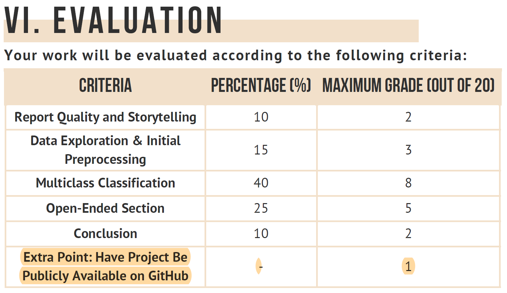

# ML Project 24.25 - [WCB | Notebooks]

Work developed in the Machine Learning project of the Master's in Data Science and Advanced Analytics at NOVA IMS.

> The main goal of this project is develop a multiclass classification model to predict the New York Workers' Compensation Board's decision on injury claims, optimize its performance, and provide additional insights through feature analysis and model improvements. 

 

#### Group 33

- André Silvestre, 20240502
- João Henriques, 20240499
- Simone Genovese, 20241459
- Steven Carlson, 20240554
- Vinícius Pinto, 20211682
- Zofia Wojcik, 20240654
  
 

---

 Professor Suggestions 📌

1. **Can we do the split between train validation and test before feature preprocessing**
  
> - Yes, you can do the split before the preprocessing. The idea is to avoid **data leakage** from the test set to the training set. However, you should be careful with the preprocessing steps that depend on the data distribution. For example, if you are going to use the mean of a feature to impute missing values, you should calculate the mean only on the training set and use it to impute the missing values in the validation and test sets.

> In this case, we are assume that Cross-Validation method is used is **Hold-out Method**.

2. **Do we need to do all the preprocessing steps inside the cross validation for loop including missing values treatment, scaling and encoding**

> If our approach is to use the **K-Fold Cross-Validation** method, we should do all the preprocessing steps inside the loop. This is because the validation set is different in each iteration, so the preprocessing steps should be done for each fold. However, if we are using the **Hold-out Method**, we can do the preprocessing steps before the loop.

i. **If so, how should we proceed in relation to feature selection procedures like RFE, Ridge because to include all features in the process they must be encoded**

> For encoding we can define a dictionary with the encoders and apply them inside the loop. For example, we can define a dictionary with the encoders for each feature type (e.g., one-hot encoding for categorical features and standardization for numerical features) and apply them inside the loop. 
> For feature selection procedures like RFE and Ridge, we can define the model and the feature selection method inside the loop and apply them to the training set. **[Idea is obtain different features for each fold and see if the model is consistent -> More robust solution]**

3. **Can the encoding be done on the whole dataset? Meaning can we make the fit on the whole data ?**

> We can! 

4. **Feature selection** 
  i. **Three approaches regarding one hot encoded features ii. age has 4 categories -> if 2 are not important what do we do ?**
     1) Drop the 2 not important features ✅ (We need to treat the class as a feature)
     2) ~~Drop all of them~~
     3) ~~Keep all of them~~

5. **Does experimenting with different/random features does it make sense ?**

> He prefers to use simple methods right than complex methods wrong.

6. **When applying scalling for RFE do we apply the scalling for both original categorical (label and OHE) features and numerical features**

> Depend on which CV method we are using. If we are using **Hold-out Method**, we can do the preprocessing steps before the loop. If we are using **K-Fold Cross-Validation**, we should do all the preprocessing steps inside the loop.

 

> -------
> ***Extra***  
> To evaluate Kaggle (2val of the final grade, the other 18 being the report) it will use the range min=sample_submission==0val and max=max_best_group==2val and the grades will be dates based on this range

  

---

Next Steps 🚀

### **CRISP-DM**

1. **Business Understanding**
2. **Data Understanding**
3. **Data Preparation**
4. **Modeling**
5. **Evaluation**
6. **Deployment**

  

---

## **Report Rules**

> - A report that describes the analytical processes and the conclusions obtained with, at most , **10 pages** (excluding cover , abstract and annexes) .
>   - Heading 1: Calibri , Size 14 pt, in bold
>   - Heading 2 (if needed) : Calibri , Size 13 pt, in bold
>   - Text: Calibri , Size 11 pt, line spacing of 1.15 pt and paragraph spacing of 6 pt
> - The body of text should only include Figures and Tables that are essential to understanding your work. Supporting figures and Tables can be added to Annexes.
> - Please make sure all figures and Tables ( including the ones in annexes) are identified and referenced in the text . Any figure or table should have an explicit purpose to be included.
>
>

> 
>

>  
> Your grade will reflect our assessment of the quality of your work in terms of quality of writing, clarity, conciseness, correctness and efficiency. Please find below more details about what is taken into account for each topic:
> 
> - **Report Quality and Storytelling (2v):** A good report should, by itself, give the reader a clear picture of the problem you are tasked with, the steps you took, the rationale behind those steps, your main results and your insights. When referencing a figure, ensure you direct the reader's attention to the point you want to convey. This section also encompasses the overall quality of your introduction and conclusions.
>
> - **Data Exploration \& Initial Preprocessing (3v):** Describe the data and extract meaningful insights that you consider helpful. Avoid adding visualizations and elements that do not address the problem at hand. In addition, it should also unambiguously explain the steps and rationale behind your steps into cleaning the data into something usable by your predictive models.
>
> - **Multiclass Classification (8v):** Describe your strategy for the text classification objective. This section is separated into different components:
>   - Kaggle Performance: **2v**
>   - Additional Preprocessing: **1v**
>   - Feature Selection: **1v**
>   - Modelling approach - model assessment strategy (holdout, cross-validation, etc...) and algorithms (minimum of 5 covered in class) used: **1.5 v**
> - Performance assessment - rationale for choice of evaluation metric(s) and interpretation of results: **1.5 v**
> - Model optimization: **1 v**
>
> - **Open-Ended Section (5v):** Describe your strategy for the additional insights objective. This section is separated into different components:
> - Formulation and Adequacy of the Objectives: **0.5 v**
> - Difficulty of tasks: **1.5 v**
> - Correctness/efficiency of implementation: **1.5 v**
> - Discussion of results: **1v**
> - Alignment between results and communicated objectives: **0.5 v**
>
> - **Conclusion (2v):** A good conclusion perfectly summarizes the work done. It draws from the information and questions formulated the introduction and directs the results obtained to address them. Moreover, it also lays out the path ahead, such as discussing the limitations of the work and hinting at what could be done in the future.
>
>   
> **PARTING NOTES**
> 1. ~~Deliveries after the deadline will be penalized at 1 point per day.~~
> 2. **Deliveries made before the deadline will receive a bonus of 0.15 points per day of delivery in advance (up to a maximum of 1 point).** 🔵
> 3. ~~For modelling purposes, using Lazy Predict or similar AutoML (e.g. Feature Tools, TSFresh) packages is explicitly off-limits and will result in a 1-point penalty.~~
> 4. The report will be the primary method of evaluating your work. When preparing it, remember that a reader should be able to understand your work without needing to check your notebook. We won't consider any steps or results not mentioned in your report.
> 5. Everything in your report must have a clear purpose. Avoid including irrelevant, unimportant, or redundant information, as the space is limited, and you will need it. Also, please don't provide theoretical explanations of topics covered in class.
> 6. ~~The trustworthiness of the information you provide is key. You should look to source information from peer-reviewed journals (thus, avoid citing Medium, TowardsDataScience and similar sources).~~
> 7. Before submitting, run your notebook from the start one last time (if you used a GridSearch, you can comment this cell, but you should run the final model with the GS parameters in a different cell).
> 8. Your submitted notebook should include all the unneeded code you used to obtain your final solution, but it should also be commented.
> 9. We will run your Jupyter Notebooks if we have any doubts. So, please make sure we can run the notebook from start to finish in one go. Notebooks that do not fulfil this condition will be penalized.
> 10.  The report and code will pass through a process of plagiarism and AI generation checking.
> 11. **You must submit to the Kaggle competition to get points for that component.**
> 12.  When determining the grade for your work, there will be a comparative component between it and the work presented by your peers.
> 
>  
>  
> **Friendly Reminders**
> 
> 1. Attendance at the defense is mandatory for approval in the project. The defense has a group component and an individual component.
> 2. As questions are individualized, every group member should be able to understand what was done at every step of the way.
> 3. If something is good enough to be mentioned in the report, it is also good enough to know. **DO NOT include techniques/algorithms/steps you cannot explain in your report: we may (and probably will) ask about them in the defense.**
> 4. ~~Finished is better than perfect.~~

  

<h2>Report Structure</h2>

 

### 0. Abstract

> A small summary of your work (200 to 300 words). The abstract should give an overview of your work: What is the context? What are your goals? What did you do? What were your main results, and what conclusions did you draw from them?

### 1. Introduction

> - Overview of the project
> - Main goals of the project 
> - Are there any similar works/applications? What has been done? What did other researchers find? What would you expect your results to be based on their previous findings? 

- **1.1. Context**
- **1.2. Problem Statement**
- **1.3. Objectives**
- **1.4. Methodology**
- **1.5. Structure**

### 2. Data Exploration and Prepocessing

> - Description of data received -> key insights
> - Steps taken to clean and prepare the data

- **2.2. Data Description**
- **2.3. Data Quality**
- **2.4. Data Exploration, Cleaning \& Feature Engineering🟣**
  - **`Claim Injury Type`** [Target Variable]
  - **`Accident Date`**, **`Assembly Date`**, **`C-2 Date`**, **`C-3 Date`🔴** and **`First Hearing Date`🔴**
    - **`C3 Date Binary`** and **`First Hearing Date Binary`** 🟣🟢
    - **`Days, Weekdays, Months, Years`** 🟣
    - **`Accident Date Binary`**, **`Assembly Date Binary`** and **`C2 Date Binary`** 🟡
  - **`Age at Injury`🟢** \& **`Birth Year`🔴**
    - Imputation Strategy for **`Age at Injury`** 🟣
  - **`Gender`🟢**
  - **`Alternative Dispute Resolution`**
  - **`Attorney/Representative`**
  - **`COVID-19 Indicator`**
  - **`Average Weekly Wage`**
    - **`Weekly Wage Reported`** 🟣
  - **`IME-4 Count`**
    - **`IME-4 Reported`** 🟣
  - **`Carrier Name`🔴** & **`Carrier Type`🟡**
    - **`Carrier Type Bucket`** 🟣
  - **`Industry Code`🟢** & **`Industry Code Description`🔴**
  - **`WCIO Cause of Injury`** [Code🟡 & Description🔴]
    - **`WCIO Cause of Injury Bucket`** 🟣
  - **`WCIO Nature of Injury`** [Code🟡 & Description🔴]
    - **`WCIO Nature of Injury Bucket`** 🟣
  - **`WCIO Part Of Body`** [Code🟡 and Description🔴]
    - **`WCIO Part Of Body Bucket`** 🟣
  - **`Number of Dependents`** 🔴
  - **`Zip Code`** 🔴, **`County of Injury`** 🔴, **`District Name`** and **`Medical Fee Region`** [Region Information]
- **2.5. Data Splitting**
- **2.6. Feature Selection🟢🟡🔴**

---

#### Legend

- 🟢: Features that we keep on 1st Approach & Can be used in the model
- 🟡: Features that we drop on 1st Approach & Can try to use now
- 🔴: Features that we drop & Cannot be used in the model
- 🟣: Feature Engineering (Variables that we created or modified)

---

> aaaaa

---

### 3. Multiclass Classification 🟤⚫

> - Additional preprocessing steps adopted
> - Feature Selection Strategy
> - Explanation of model assessment strategy and metrics used
> - Comparison of performance between candidate algorithms
> - **Optimization efforts:** presentation, results and discussion

- **3.1. Baseline Model**
  - Model with all features
- **3.2. Model Selection**
  - **`Logistic Regression`**
  - **`Naive Bayes`**
    - **`Categorical Naive Bayes`**
    - **`Gaussian Naive Bayes`**
  - **`K-Nearest Neighbors (KNN)`**
    - **`Brute Force KNN`**
    - ~~**`KD Tree KNN`**~~ [Too much time compared to `Brute Force`]
    - ~~**`Ball Tree KNN`**~~ [Too much time compared to `Brute Force`]
  - **`Neural Network [MLPClassifier]`**
    - *How we will define the parameters?* ⚠️
  - **`Decision Tree`**
    - *How we will define the parameters (max_features, min_impurity_decrease, max_depth)?* [GridSearchCV ??] ⚠️
  - **`Support Vector Machine (SVM)`**
    - *How we will define the parameters (C, kernel, degree, gamma)?* [GridSearchCV ??] ⚠️
  - **Ensemble Methods**
    - **`BaggingClassifier`**
      - We need to choose the models to use
    - **`RandomForestClassifier`**
    - **`AdaBoostClassifier`**
    - **`Gradient Boosting`**

- **3.3. Hyperparameter Tuning**
  - **`GridSearchCV`**
  - **`RandomizedSearchCV`**
- **3.4. Model Evaluation**
- **3.5. Model Performance**
- **3.6. Feature Importance**
- **3.7. Model Improvement**
- **3.8. Model Interpretability**

### 4. Open-Ended Section

> - Objectives for the Section
> - Description of the actions taken
> - Results and discussion of main findings

- **4.1. Variable Importance**
  - How we did it and what we found
- **4.2. Web Application**
  - Main features and functionalities

### 5. Conclusions

> - Summary of initial objectives and discussion of corresponding findings
> - Do the findings match what you initially expected? How?
> - Discussion of limitations of your work (e.g. what could you have done differently)
> - Suggestions for possible work to fol low on your work.

- **5.1. Summary**
- **5.2. Findings**
- **5.3. Limitations**
- **5.4. Future Work**

### References

---
